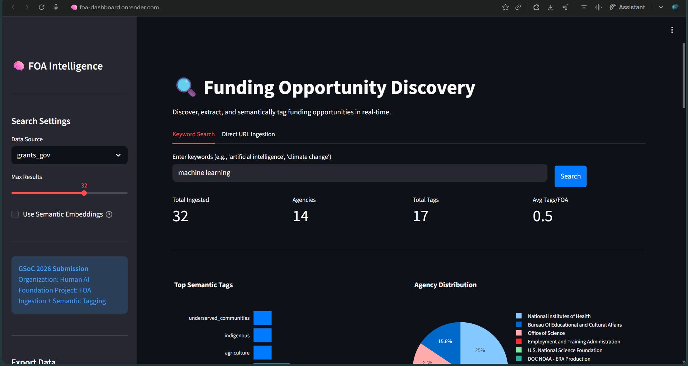
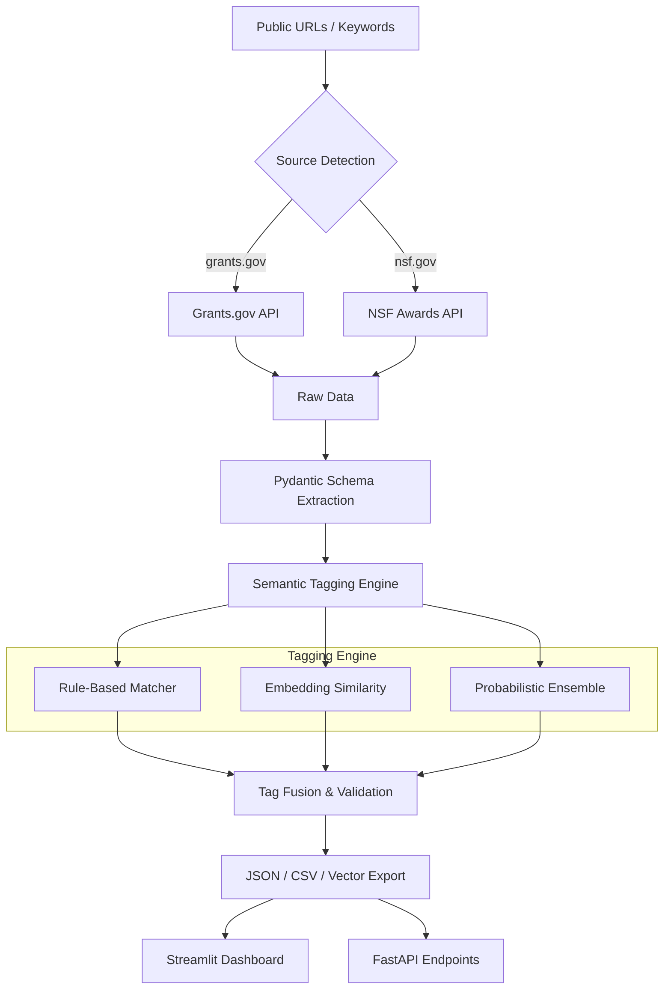

# FOA Intelligence 🧠🔬

[](https://www.python.org/downloads/)
[](https://humanai.foundation/gsoc/projects/2026/project_ISSR.html)
[](https://foa-api.onrender.com/docs)
[](https://opensource.org/licenses/MIT)

**AI-Powered Funding Intelligence — FOA Ingestion + Semantic Tagging**

A production-grade pipeline that automatically ingests Funding Opportunity Announcements (FOAs) from public sources, extracts structured fields, and applies ontology-based semantic tags to support institutional research discovery and grant matching.

---

## ⚡ Live Production Endpoints

| Service | Environment | URL |
|---------|-------------|-----|
| **Web Dashboard** | Production | [https://foa-dashboard.onrender.com/](https://foa-dashboard.onrender.com/) |
| **API Documentation** | Swagger UI | [https://foa-api.onrender.com/docs](https://foa-api.onrender.com/docs) |

---

## 🌟 Visual Overview


*Real-time Discovery and Tagging Interface*

### 🎬 System Demo


---

## 📐 Architecture & Scale

The system is designed with a modular, source-agnostic architecture capable of processing thousands of FOAs with high precision.



---

## 🚀 Key Features

- **Multi-Source Ingestion**: Native integration with Grants.gov and NSF REST APIs.
- **Microservice Architecture**: Decoupled FastAPI backend and Streamlit frontend.
- **Hierarchical Ontology**: 30+ semantic tags across 4 categories (Domains, Methods, Populations, Themes).
- **Hybrid Tagging**: Combines deterministic keyword matching with semantic embedding similarity (`all-MiniLM-L6-v2`).
- **Production Ready**: Full validation using Pydantic, comprehensive logging, and automated deployment via Render.

---

## 📁 Project Structure

```
FOA-Intelligence/
├── api.py                   # FastAPI Production Backend
├── app.py                   # Streamlit Interactive UI
├── main.py                  # Pipeline Orchestration Logic
├── render.yaml              # Infrastructure-as-Code (Render)
├── demo.ipynb               # Technical Deep-Dive Notebook
├── config/                  # Ontology & System Settings
├── src/                     # Core Engine Architecture
│   ├── ingestion/           # Source Adapters (API/Scrapers)
│   ├── extraction/          # Schema & Normalization
│   └── tagging/             # NLP & Semantic Engine
└── assets/                  # Media & Visual documentation
```

---

## 🛠️ Tech Stack & Reliability

- **Frameworks**: FastAPI, Streamlit, Pydantic
- **NLP/ML**: Sentence-Transformers, Scikit-Learn, PyYAML
- **Infrastructure**: Render Blueprint, GitHub Actions Ready
- **Data**: RESTful API Integration, JSON/CSV Serialization

---

## 🧪 Development & Evaluation

### Local Setup
```bash
pip install -r requirements.txt
python main.py --search "artificial intelligence" --max-results 5
```

### Run Tests
```bash
pytest tests/ -v
```

---

## 🙏 Acknowledgments

- **Human AI Foundation** — GSoC 2026 Mentoring Org
- **ISSR, University of Alabama** — Research & Mentorship
- **Grants.gov** & **NSF** — Data Providers